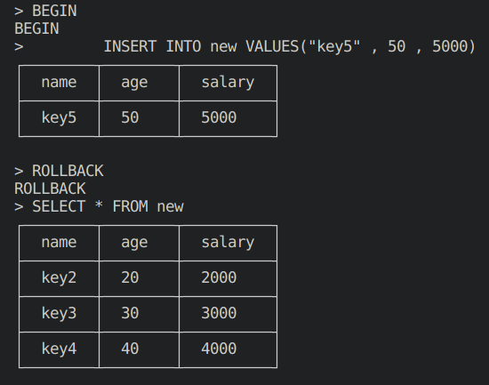

# ANDB
ANDB is a relational database management system (RDBMS) designed to handle complex queries and manage data efficiently. It features an SQL parser and uses B+ trees for indexing to ensure fast data retrieval and organization.

# Features
Relational Database Management: Organize and manage data in a structured, tabular format.
SQL Parser: Parse and execute SQL statements for querying and manipulating data.
B+ Tree Indexes: Utilize B+ trees for efficient indexing and fast data access.
Thread Management: Handle multiple queries and operations simultaneously with a multi-threaded architecture.

# Getting Started
### Prerequisites
C++11 or later
CMake (for building the project)
Basic understanding of SQL and relational databases
### Building
Clone the Repository:

```
git clone https://github.com/yourusername/MyRelationalDB.git
cd andb
```
Build the Project:

```
mkdir build
cmake -B build -S .
cmake --build ./build
```
### Starting Daemon
```
./build/andb-daemon
```


# Usage
Open new terminal </br>
### Start the Cli
```
./build/andb-cli
```
### Connect to database / Create a database

```CONNECT <database_name>```

Connects to the specified database. Creates the database if it does not exist.


```EXIT```

Terminates the current session 

### Create Table 

```
CREATE TABLE new (name STRING , age INT, salary INT)
```


### Insert a tuple

```
INSERT INTO new VALUES("key1" , 10 , 5000)
```
```
INSERT INTO new VALUES("key2" , 20 , 2000)
```
```
INSERT INTO new VALUES("key3" , 30 , 3000)

```


### View Table


```
SELECT * FROM new
```


### Update a tuple

```
UPDATE new SET salary = 1111, age = 11111 WHERE name = "key1"
```


### Delete a tuple

```
DELETE FROM new WHERE name = "key1"
```


### Transactions
```
BEGIN
INSERT INTO new VALUES("key4" , 40 , 4000)
COMMIT
```


```
BEGIN
INSERT INTO new VALUES("key5" , 50 , 5000)
ROLLBACK
```



# Architecture
***SQL Parser*** : Handles the parsing and execution of SQL queries.</br>
***B+ Tree Indexing*** : Provides efficient indexing and quick access to data.</br>
***Daemon Service*** : Runs in the background to handle database operations.</br>
***CLI Tool*** : Provides a command-line interface to interact with the database.</br>